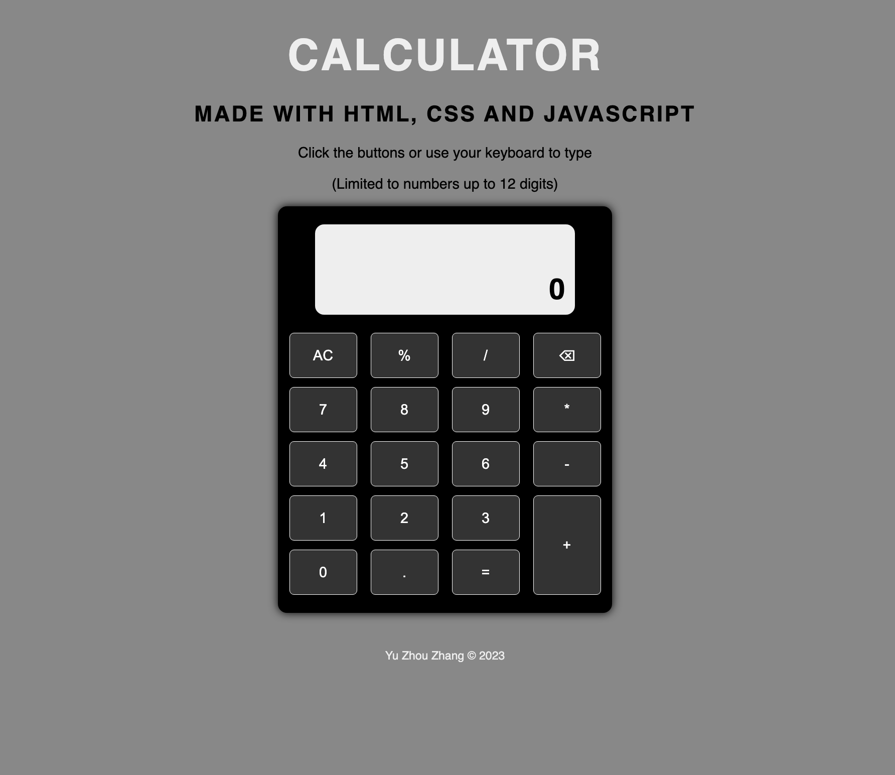

    

<h2 align="center">Calculator</h2>

  

  To help you work things out  
  

   
  <a href="https://errantpianist.github.io/odin-calculator/">View Demo</a>
  

 

## Preview

 

### Built With

- 
- 
- 

## Features

- A lighting-fast calculator implemented using pure HTML/CSS/JS
- Supports mouse clicks and keyboard presses

 

## Outcome

- Used CSS3 **grid** and **flex** to manage layout
- Used keyboard and mouse event listeners to add functionality
- Used **Git** to manage project

 

## What I learned

- Modularising code into simple functions

 

## Reflections

This is a calculator built purely using HTML/CSS/JavaScript.
It was satisfying putting keyboard event listeners onto it and marvelling at the instant response times.

 

## Acknowledgments

- Thanks to [The Odin Project](https://www.theodinproject.com/) for putting together such an extensive open-source curriculum!
   

<!-- CONTACT -->

## Author

